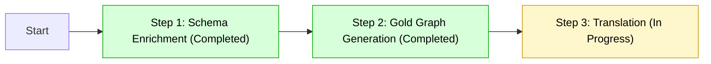
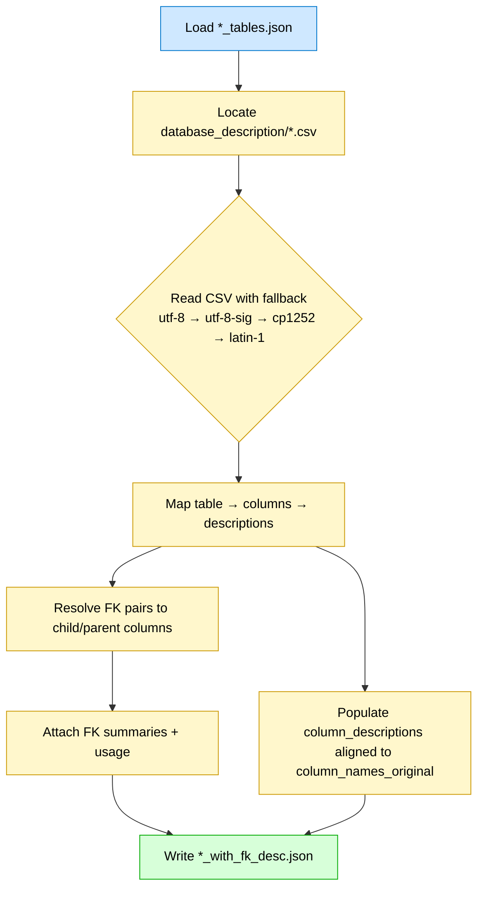
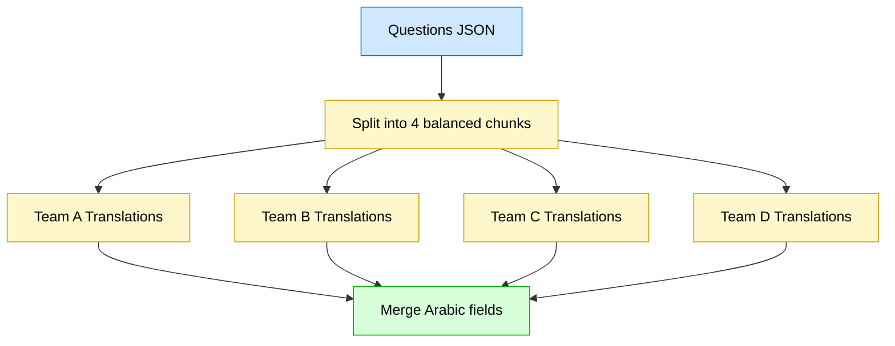
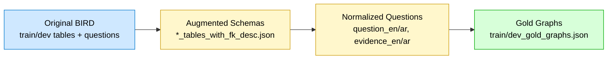
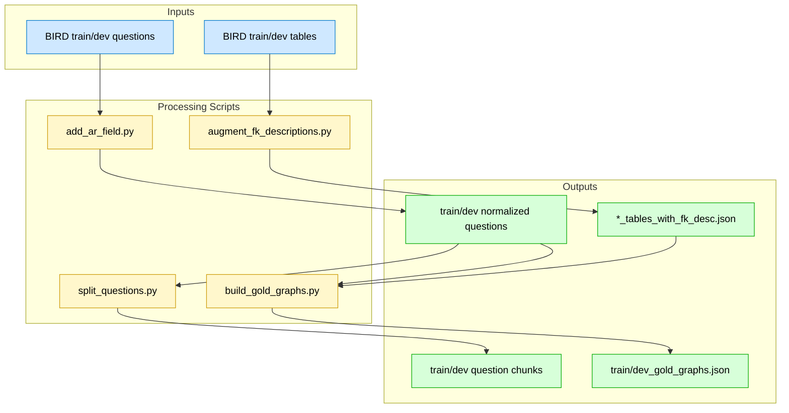

# Arabic-BIRD: Schema-Enriched Arabic Extension of the BIRD Text-to-SQL Benchmark

## Overview
This repository introduces **Arabic-BIRD**, a schema-enriched Arabic extension of the BIRD Text-to-SQL benchmark. The aim is to advance research in **cross-lingual semantic parsing** and provide a high-quality Arabic dataset for Text-to-SQL tasks.

This release targets research in **multilingual Text-to-SQL**, **semantic parsing**, **schema linking**, and **cross-lingual generalization**.

---

## Contributions
This work provides the community with:

### ✅ 1. Arabic-BIRD Dataset (New Resource)
A high-quality Arabic version of the BIRD Text-to-SQL dataset (train/dev), including aligned English–Arabic question and evidence pairs.

### 🧠 2. Schema-Enriched Cross-Lingual Annotation Pipeline
A reproducible methodology for enriching database schemas with column semantics and foreign-key context to enhance cross-lingual understanding.

### 🌍 3. Extension of BIRD with Schema Context for Arabic
An augmented version of BIRD incorporating column-level descriptions and FK usage summaries for improved schema linking and reasoning.

---

## Contributors

### 👨‍💻 Core Development
- **[@AbdelrahmanAboegela](https://github.com/AbdelrahmanAboegela)** - Lead Developer
  - ✅ **Phase 1**: Schema Enrichment (Completed)
  - ✅ **Phase 2**: Gold Graph Generation (Completed)
  - 🛠️ Pipeline Architecture & Implementation

### 🌍 Translation Team
The following contributors are working on **Phase 3: Arabic Translation**:

- **[@ibrahim-abd-elmotteleb](https://github.com/ibrahim-abd-elmotteleb)** — Ibrahim Abdelmotteleb (Translator)
- **[@SHEhabDevPro](https://github.com/SHEhabDevPro)** — Shehab Ahmed Mohamed Farrag (Translator)
- **[@Zeyadmosalem](https://github.com/Zeyadmosalem)** — Zeyad Salem (Translator)
- **[@gina925](https://github.com/gina925)** — Gina (Translator)

*Status: Translation work is currently in progress with distributed human translation across balanced dataset chunks.*

---

## Project Phases
| Phase | Status | Description | Contributors |
|--------|---------|----------------|--------------|
| **Phase 1: Schema Enrichment** | ✅ Completed | Added column semantics and FK context to BIRD schemas | [@AbdelrahmanAboegela](https://github.com/AbdelrahmanAboegela) |
| **Phase 2: Gold Graph Generation** | ✅ Completed | Built structural join graphs for each SQL instance | [@AbdelrahmanAboegela](https://github.com/AbdelrahmanAboegela) |
| **Phase 3: Arabic Translation** | 🚧 In Progress | Human translation of `question_ar` and `evidence_ar` fields |  [Translation Team](#-translation-team) |

---

## Methodology
The pipeline systematically enriches and translates the BIRD dataset through the following stages:

### **Schema Enrichment (Phase 1)**
For each database in BIRD train/dev:
- Extract table descriptions from CSV files using multi-encoding fallback
- Map: `table → column → description`
- Resolve FK pairs into child/parent relations and attach:
  - semantic summaries
  - usage context
- Generate `*_tables_with_fk_desc.json`

### **Gold Graph Generation (Phase 2)**
- Construct table–column graphs per example to surface join paths and schema traversal
- Provide an interactive visualization for researchers and annotators

### **Arabic Translation (Phase 3)**
- Normalize question structure to include `question_en`, `question_ar`, `evidence_en`, `evidence_ar`
- Split dataset into four balanced subsets for distributed human translation

---

## Reproducibility
All scripts are provided for full reproducibility.

### Phase 1 — Schema Enrichment
```bash
python BIRD/scripts/augment_fk_descriptions.py --split train
python BIRD/scripts/augment_fk_descriptions.py --split dev
python BIRD/scripts/augment_fk_descriptions.py --split both
```

### Phase 2 — Gold Graph Generation
Requires: `pip install sqlglot networkx`
```bash
python BIRD/scripts/build_gold_graphs.py --split both
```
Outputs:
- `BIRD/train/train_gold_graphs.json`
- `BIRD/dev_20240627/dev_gold_graphs.json`

### Optional Viewer
```bash
pip install pyvis
python BIRD/graph_viewer/server.py
```
Navigate to: http://127.0.0.1:8081

### Phase 3 — Translation Utilities
Normalize bilingual fields:
```bash
python BIRD/scripts/add_ar_field.py
```
Split into 4 translator chunks:
```bash
python BIRD/scripts/split_questions.py BIRD/train/train.json \
  BIRD/dev_20240627/dev.json BIRD/dev_20240627/dev_tied_append.json --parts 4
```

---

## Repository Structure
```
BIRD/
 ├─ train/
 │   ├─ train_tables.json
 │   ├─ train_tables_with_fk_desc.json
 │   ├─ train.json
 │   └─ train_part{1..4}of4.json
 │
 ├─ dev_20240627/
 │   ├─ dev_tables.json
 │   ├─ dev_tables_with_fk_desc.json
 │   ├─ dev.json
 │   ├─ dev_tied_append.json
 │   ├─ dev_part{1..4}of4.json
 │   └─ dev_tied_append_part{1..4}of4.json
 │
 ├─ scripts/
 │   ├─ augment_fk_descriptions.py
 │   ├─ add_ar_field.py
 │   ├─ split_questions.py
 │   └─ build_gold_graphs.py
 │
 └─ graph_viewer/
     ├─ server.py
     └─ static/
```

---

## Notes
- Missing column descriptions remain empty, but FK summaries preserve relational meaning
- Column matching is robust and encoding-agnostic
- Fully offline processing — no external downloads required

---

## Future Work
- Complete Arabic translation for all fields
- Provide Arabic schema summaries (`summary_ar`, `column_description_ar`)
- Release evaluation benchmarks for Arabic Text-to-SQL
- Prepare a research paper submission with evaluation results

---

## Diagrams

### 1) Project Pipeline Overview


### 2) Schema Enrichment Process


### 3) Parallel Translation Workflow


### 4) Data Structure Transformation


### 5) System Architecture


## License
This repository includes derived metadata from the BIRD dataset. Please adhere to the original BIRD licensing terms for redistribution and usage.
