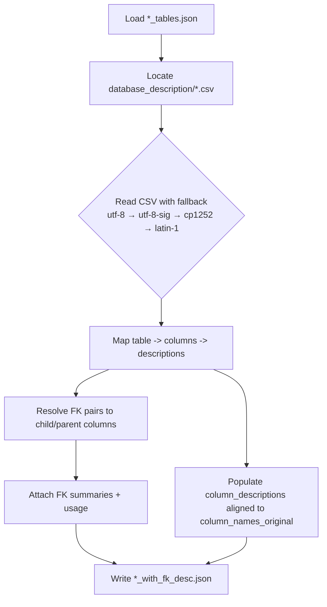
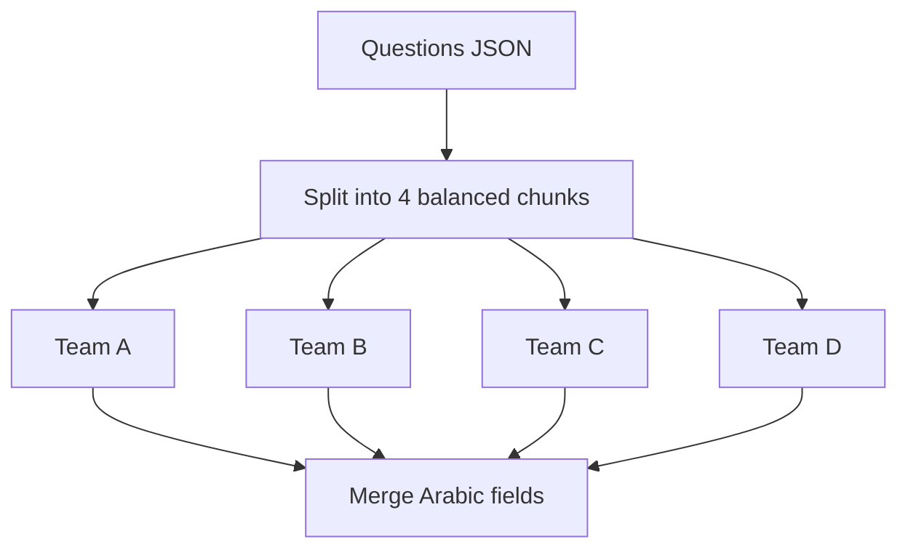
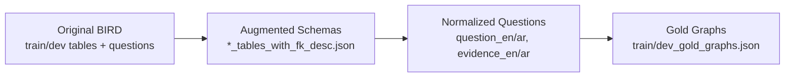
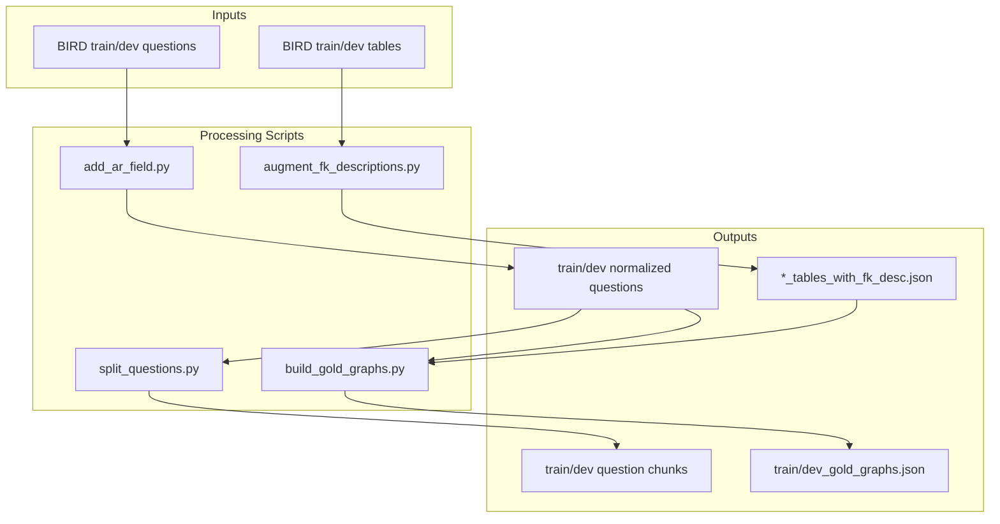

# BIRD Arabic Translation & Schema Context Augmentation

## Objective
Translate the BIRD Text-to-SQL dataset (train/dev) into Arabic to expand high‑quality Arabic resources. Currently there are only two Arabic versions of Spider; this project targets broader Arabic coverage for Text‑to‑SQL.

## Plan Overview
- Step 1 — Schema enrichment (completed):
  - Add per‑column meanings and clear FK usage into the BIRD `*_tables.json` so models get better context (helps with ambiguous names like `id`, `code`, `abbreviation`).
- Step 2 — Translation (in progress):
  - Normalize question entries to include `question_en`/`question_ar` and `evidence_en`/`evidence_ar`.
  - Split questions into 4 balanced chunks per file so 4 team members can translate in parallel with no duplicates.

## What We Built
- Schema enrichment to improve model grounding on ambiguous columns.
- Normalized questions with Arabic placeholders to streamline translation.
- Chunking utilities to distribute work across the team.
- Gold graph generation with an interactive viewer to explore tables/joins per question.

## How It Works
For each DB in train/dev tables JSON:
- Locate `database_description/*.csv` by table name.
- Build a map: `table -> { column -> column_description }` using robust normalization and encoding fallbacks (utf-8, utf-8-sig, cp1252, latin-1).
- For `foreign_keys` (index pairs), resolve child/parent columns and attach a description object:
  - child_table, child_column, parent_table, parent_column
  - child_description, parent_description
  - summary (concise, non‑redundant), usage
- For all columns, populate `column_descriptions` aligned to `column_names_original` (empty string for the special `[-1, "*"]` row).

## Reproducibility
Prerequisites: Python 3.8+ (no external packages)

- Augment schemas (writes `*_with_fk_desc.json`):
  - Train: `python BIRD/scripts/augment_fk_descriptions.py --split train`
  - Dev: `python BIRD/scripts/augment_fk_descriptions.py --split dev`
  - Both: `python BIRD/scripts/augment_fk_descriptions.py --split both`

- Normalize questions & add Arabic placeholders:
  - `python BIRD/scripts/add_ar_field.py`

- Split questions into 4 chunks for translators:
  - `python BIRD/scripts/split_questions.py BIRD/train/train.json BIRD/dev_20240627/dev.json BIRD/dev_20240627/dev_tied_append.json --parts 4`

### Gold graphs (Step 2 — completed)
- Install deps: `pip install sqlglot networkx`
- Build: `python BIRD/scripts/build_gold_graphs.py --split both`
- Outputs:
  - `BIRD/train/train_gold_graphs.json`
  - `BIRD/dev_20240627/dev_gold_graphs.json`

### Interactive graph viewer
- Install: `pip install pyvis`
- Run server: `python BIRD/graph_viewer/server.py`
- Open: `http://127.0.0.1:8081` and filter by split/db, click a question

## Repository Contents (tracked)
- `BIRD/train/`
  - `train_tables.json` (original schema)
  - `train_tables_with_fk_desc.json` (schema + FK and column descriptions)
  - `train.json` (questions with EN/AR fields)
  - `train_part{1..4}of4.json` (split for translators)
- `BIRD/dev_20240627/`
  - `dev_tables.json` (original schema)
  - `dev_tables_with_fk_desc.json` (schema + FK and column descriptions)
  - `dev.json`, `dev_tied_append.json` (questions with EN/AR fields)
  - `dev_part{1..4}of4.json`, `dev_tied_append_part{1..4}of4.json` (split for translators)
- `BIRD/scripts/`
  - `augment_fk_descriptions.py` (augmentation)
  - `add_ar_field.py` (EN/AR normalization)
  - `split_questions.py` (chunking)
  - `build_gold_graphs.py` (gold graph builder)
- `BIRD/graph_viewer/`
  - `server.py` (viewer server)
  - `static/` (HTML/CSS/JS)

## Notes
- If a CSV lacks a column description, the corresponding entry in `column_descriptions` stays empty; FK summaries still describe the relationship.
- Name matching is robust (case‑insensitive, ignores separators) with encoding fallbacks.
- No network is needed; dev databases ZIP is handled locally if present.

## Next Steps
- Step 3: Translate `question_ar` and `evidence_ar` across all chunks (in progress).
- Optionally add Arabic schema summaries (e.g., FK `summary_ar`, Arabic column descriptions).
- QA and publish an Arabic BIRD release for the community.

## Diagrams

### 1) Project Pipeline Overview
```mermaid
flowchart LR
    A[Start] --> B[Step 1: Schema Enrichment\n(Completed)]
    B --> C[Step 2: Gold Graph Generation\n(Completed)]
    C --> D[Step 3: Translation\n(In Progress)]
    style B fill:#d7ffd9,stroke:#0a0;color:#000
    style C fill:#d7ffd9,stroke:#0a0;color:#000
    style D fill:#fff7cc,stroke:#cc9a06,color:#000
```

### 2) Schema Enrichment Process


### 3) Parallel Translation Workflow


### 4) Data Structure Transformation


### 5) System Architecture


## License
This repository includes derived metadata from the BIRD dataset. Please follow BIRD’s terms for redistribution and use.


